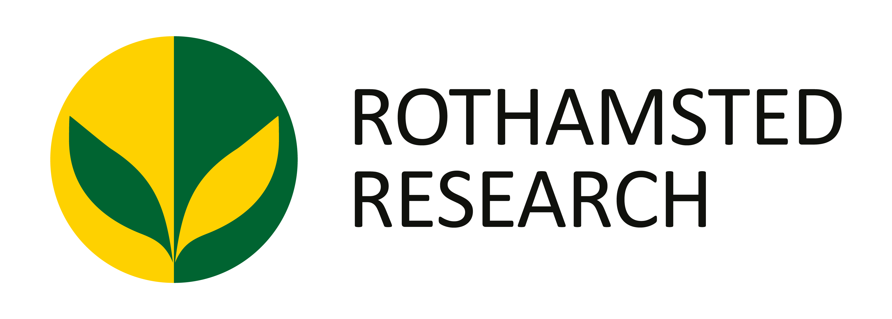

# Rothamsted Data Hackathon: Communicating Science through Data

**"Hackathon: , an integration of the words hack and marathon, is traditionally an event in which a large number of people meet to engage in collaborative computer programming."**

Rothamsted Research, with strategic funding from UKRI BBSRC, hosts three internationally renowned National Bioscience Research Infrastructures (NBRIs); the Rothamsted Long-Term Experiments (RLTEs), the North Wyke Farm Platform (NWFP) and the Rothamsted Insect Survey (RIS).They exist for the benefit of the scientific community in general and both their facilities and the open datasets they produce are freely available to researchers.

Under the guidance of our NBRI experts, you will have access to the data and APIs (Application Programming Interfaces) with a challenge to communicate our NBRIs science and achievements through data.  

### Technical Information: 
You can find more information on our three National Bioscience Research Infrastructures and their data on their respective web sites and our  [Data Resource](https://github.com/Rothamsted-Ecoinformatics/RothDataHackathon2025/blob/main/Data%20Information%20-%20ALL.md) specially designed for this hackathon

- **e-RA and the Rothamsted Long-term Experiments: the oldest, continuous agronomic experiments in the world .**  
    [https://www.era.rothamsted.ac.uk/](https://www.era.rothamsted.ac.uk/)
- **The North Wyke Farm Platform ‘farm lab’ is a large-scale research facility to study the complete flow of nutrients from soil to food, with the clear and distinct aim of making farming a more sustainable endeavour.**  
    [https://nw-farmplatform.rothamsted.ac.uk/](https://nw-farmplatform.rothamsted.ac.uk/)  
    
- **The Rothamsted Insect Survey is a nationwide network of light-traps and suction-traps that collect invaluable data on the migration of moths, aphids and insect biodiversity more generally.**  
    [https://insectsurvey.com/](https://insectsurvey.com/)

### Practical Information
You will find information about Venue, what to bring, travel and so on in our [[Practical Information]] pack

## How To Submit Your Project? 

After you have formed a team, worked out a project description and have a created a repository with a simple README file, you will be ready to submit your project. We expect all the team projects to be submitted by the end of the first day. 

Follow the steps to submit your project in the hackathon:

* Visit the **Issues** tab in the respository and click on **New Issue**

* Find the **Hackathon Submission** option and click on **Get Started** 

* **Enter your submission details and you're good to go!**

## Prizes categories

### Public Engagement Award: 

An opportunity to the winning team of the category of public engagement to bring their idea to New Scientist Live (as we have a stand at the Farmers Weekly exhibit with theme ‘The Future of Food & Agriculture: Feeding the World Sustainably’).
Of course it's a high profile event and what we present there should be of high quality and to be able to provide an interesting engaging experience (ideally hands-on but not necessarily).

### The Royal Agricultural University  Inclusive AgriTech Impact Award

The AgriTech Inclusive Impact Award is a natural extension of the Royal Agricultural University’s global values and international partnerships. It’s not just a prize, it is  a reflection of RAU’s commitment to equity, sustainability, and global collaboration in agriculture.

This award celebrates the team whose project best demonstrates how agricultural data science can be harnessed to empower underrepresented communities, amplify minority voices, and create tangible benefits for developing countries. 

#### Judging Criteria:

Does the project make agricultural data more accessible to marginalized groups (e.g., smallholder farmers, indigenous communities, women in agriculture)?
Does it address data gaps that disproportionately affect minorities or low-resource regions?

##### Impact on Developing Countries

How effectively does the solution translate scientific insights into practical tools or knowledge for developing nations?
Does it consider local constraints such as limited internet access, low literacy rates, or climate vulnerabilities?

##### Cultural & Linguistic Sensitivity

Is the data presented in ways that are culturally relevant and linguistically inclusive?
Are local languages, customs, and agricultural practices respected and reflected in the solution?

##### Scalability & Sustainability

Can the solution be scaled across different regions or adapted to various socio-economic contexts?
Does it promote long-term resilience, food security, or sustainable farming practices?

### Rothamsted Award for Excellence and Innovation 
- Criteria 1: Creativity and innovation  (RV Innovation)
- Criteria 2: Technical execution (RV Excellence)
- Criteria 3: Functional MVP (Minimum Viable Product)
- Criteria 4: Problem-solving and relevance
- Criteria 5: Impact and potential
